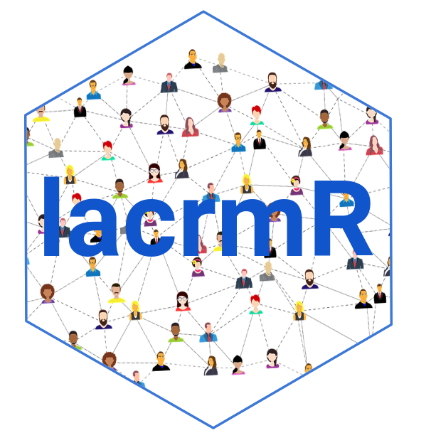

<!-- README.md is generated from README.Rmd. Please edit that file -->

# lacrmr <a href="https://ixpantia.github.io/lacrmr/"></a>

<!-- badges: start -->

[](https://cran.r-project.org/package=lacrmr)
<!-- badges: end -->

Get the information from your Less Annoying Customer Relationship
Management API in a tidy data way. Useful for getting metrics, visualize
your goals, create reports and automate your workflow.

## Overview

If you have a business or an organization that uses [Less Annoying
CRM](https://www.lessannoyingcrm.com/) to manage contacts but also you
are an R user, probably you will want to get your customer relationship
data into R and do your own analysis or even to automate your monthly
reports.

For this you will need to connect to the Less Annoying CRM API and deal
with the json file to take it to a tidy format as a first step.

This package provides you with 4 functions that makes this process
easier. These are and will return:

| Function                    | Return                                                                                                                |
|-----------------------------|-----------------------------------------------------------------------------------------------------------------------|
| **get_pipeline_report()**   | It will provide you with a dataframe containing the data corresponding to the pipeline that you need.                 |
| **get_account_information** | This will give you the information of your account.                                                                   |
| **get_contact_information** | Information related to the contact you are searching for.                                                             |
| **search_contacts**         | If you want to make sure a contact exists on your CRM, this function will return an statement confirming the contact. |

## Installation

Right now we have the development version. You can install lacrmr from
Github:

``` r
#install.packages("devtools")
devtools::install_github("ixpantia/lacrmr")
```

## Credentials:

At first you will need to obtain your [user code and API
token](https://www.lessannoyingcrm.com/help/how-to-get-your-user-code-and-api-key)
from your Less Annoying CRM. Once you have your credentials, you will be
able to use the functions and take your lacrm data into R!

If you need advice on how to do this and also what are the best
practices to not leave your credentials in your code, check the package
vignette!

## Usage

``` r
library(lacrmr)
library(mockery)
pipeline_data <- system.file("testdata/pipeline_test_data.json",
                             package = "lacrmr")
pipeline_data <- jsonlite::fromJSON(pipeline_data)

stub(where = get_pipeline_report,
     what = "jsonlite::fromJSON",
     how = pipeline_data)
```

``` r
# Load the lacrmr package in your session
library(lacrmr)

## Get the data from a specific pipeline
sales <- get_pipeline_report(user_code = "12454", 
                             api_token = "25632",
                             pipelineid = "458742fgg2544")

## Use glimpse function to check the data frame
dplyr::glimpse(sales)
```

Once you are done you will have a data frame with your customer
relationship data. This will give you the opportunity to create your own
visualizations or even your personalized dashboard.

Have fun analyzing your customer relationship data!

## Getting help

If you have problems using the functions or find a bug, please let us
know with a minimal reproducible example on
[github](https://github.com/ixpantia/lacrmr/issues) or send us an email
to <hola@ixpantia.com>
